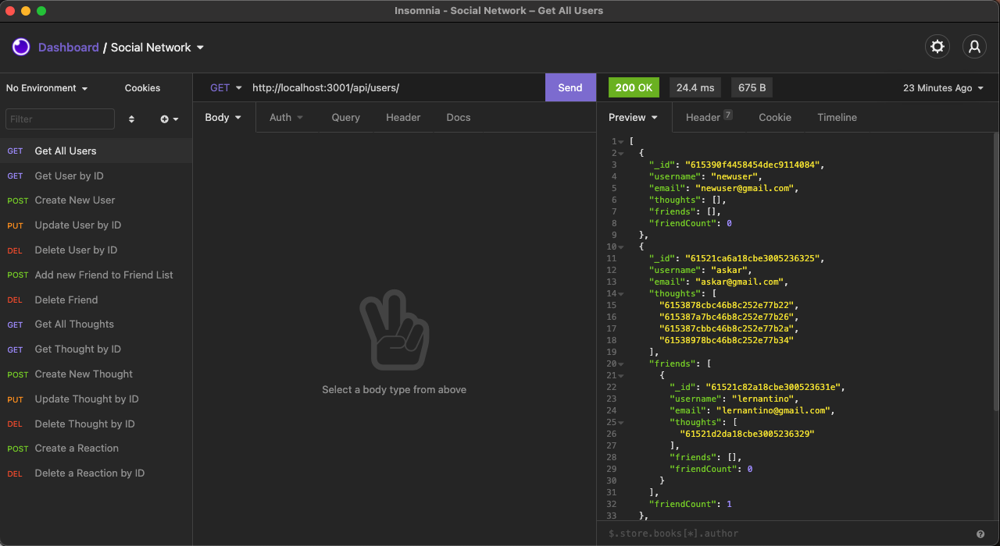
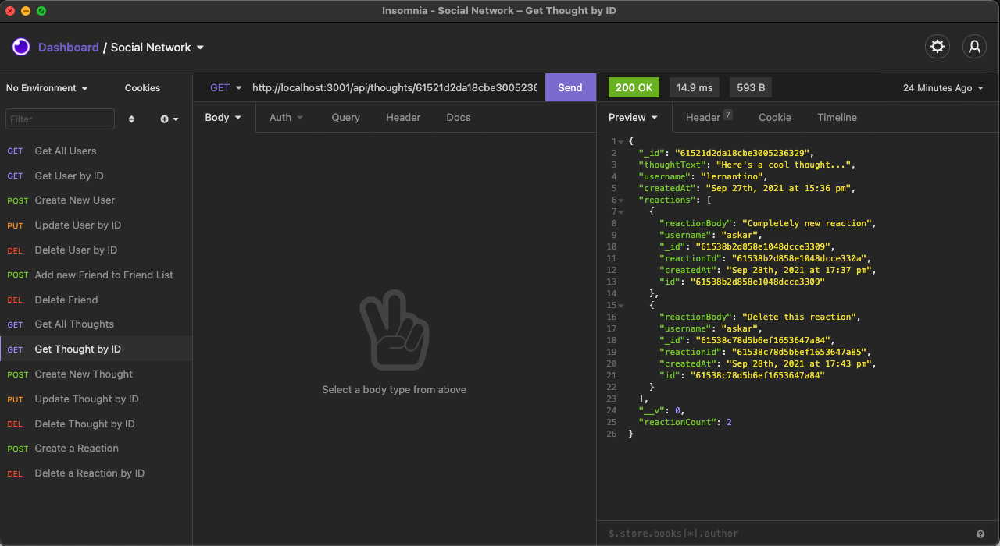
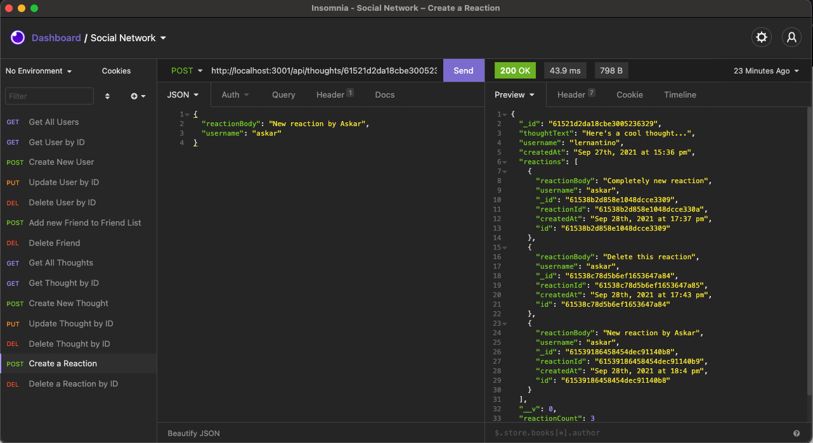

# Social Network API

  

  ## Description
  The challenge for this week involves building an API for a social networking website using Express and MongoDB. The API needs to handle creation, reading, updating and deleting of users, thoughts and reactions. There are two models that are created to handle this, a User model and a Thought model. The Thought Model includes a reaction subdocument schema.

  ## Table of Contents

* [Installation](#installation)
* [Usage](#usage)
* [License](#license)
* [Video](#video)
* [Questions](#questions)

## Installation
1: Clone the repository from Github 2:  Run NPM Install to install the modules 3:  Run "npm start" or "nodemon server.js" to start the server 4:  Run CRUD API requests from http://localhost:3001/api/users and http://localhost:3001/api/thoughts 

## Usage

## License
https://opensource.org/licenses/MPL-2.0  
Licensed under Mozilla Public License 2.0

## Video
https://watch.screencastify.com/v/fY2XZ9o7ifZA0BFIRAeC

## Questions
https://github.com/askarrizvi  
